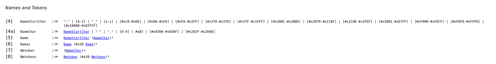

# Questions and Answers

Q. The xml files had the problem: `xml.parsers.expat.ExpatError: not well-formed (invalid token)`. Was it correct to change the XML files?
> A. Yes! In fact the XML files were incorrect for 2 reasons, the tag name starting with a number and the space in between the names. Since it was used a automatic generator to convert json to xml the output was generated incorrectly, therefore leading to this problem. The details about the XML syntax can be found here: https://www.w3.org/TR/REC-xml/#dt-name. Also, here is another useful tool to check whether the XML is valid or not: https://www.w3schools.com/xml/xml_validator.asp.

